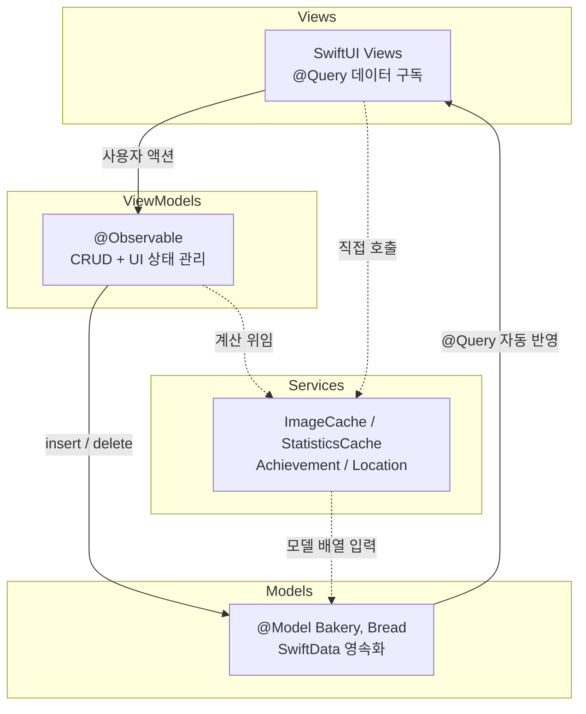

# BreadStamp

> 전 세계 빵집 탐방을 게임처럼 기록하는 iOS 스탬프북 앱


<div align="center">
  
</div>

---

## 프로젝트 정보

| 항목 | 내용 |
|------|------|
| 인원 | 1인 개발 |
| 최소 버전 | iOS 17.0 |
| 기술 스택 | SwiftUI, SwiftData, MapKit, CoreLocation, PhotosUI |
| 아키텍처 | MVVM (@Observable, iOS 17 Observation) |
| 외부 의존성 | 없음 (순수 Apple SDK) |

---

## 주요 기능

| 기능 | 설명 |
|------|------|
| 스탬프북 | 방문 빵집을 3열 그리드 스탬프 카드로 기록, 즐겨찾기 관리 |
| 빵 도감 | 먹은 빵을 7종 카테고리별로 분류하고 사진/평점/메모 기록 |
| 지도 | 방문 빵집 위치를 MapKit 마커로 표시, 주소 자동완성 검색 |
| 통계/업적 | 탐방 현황 대시보드와 9종 업적 배지 달성 시스템 |

---

## 아키텍처



View는 `@Query`로 SwiftData 변경을 자동 구독하며, ViewModel은 CRUD 메서드에 `ModelContext`를 파라미터로 받아 영속화 계층과의 결합을 최소화했습니다. Service 레이어는 상태를 갖지 않는 순수 함수 집합(`StatisticsService`, `AchievementService`)과 앱 전역 캐시 싱글턴(`ImageCacheService`, `StatisticsCacheService`)으로 구성되어 있습니다.

---

## 기술적 도전과 해결

### 1. NSCache 기반 이미지 캐싱 -- 메모리 50MB 내 자동 관리

SwiftData `externalStorage`로 저장된 이미지는 화면에 표시할 때마다 `UIImage(data:)` 디코딩이 필요한데, LazyVGrid 스크롤 중 동일 이미지가 반복 디코딩되면서 프레임 드롭이 발생하는 문제가 있었습니다.

**해결 방향:**
- NSCache를 활용하여 디코딩된 UIImage를 메모리에 보관하고, 시스템 메모리 압박 시 자동으로 해제되도록 구성
- cost 파라미터에 이미지 Data 크기를 전달하여 totalCostLimit 50MB 내에서 cost가 낮은(크기가 작은) 항목부터 우선 제거되는 방식으로 메모리를 관리
- UUID를 캐시 키로 사용하여 O(1) 조회를 보장하고, Dictionary 수동 관리 대비 메모리 안전성을 확보

> 동일 이미지의 반복 디코딩을 제거하여 스크롤 시 프레임 드롭을 해소했습니다

---

### 2. Swift Concurrency 디바운싱 -- 주소 검색 API 호출 85% 감소

MKLocalSearchCompleter는 `queryFragment`가 변경될 때마다 Apple 서버에 네트워크 요청을 전송하기 때문에, "서울시 강남구"를 한 글자씩 입력하면 7회의 요청이 발생하며 Geocoding API의 분당 50회 rate limit에 도달할 위험이 있었습니다.

**해결 방향:**
- `Task.sleep(300ms)` + `Task.isCancelled` 조합으로 Combine 없이 디바운스를 구현
- 새 입력이 들어올 때마다 이전 Task를 cancel하고 교체하여, 타이핑 완료 후 최종 1회만 API를 호출
- Swift Concurrency 단독 사용으로 외부 프레임워크 의존을 제거

| 구분 | 디바운스 미적용 | 적용 후 |
|------|---------------|---------|
| "서울시 강남구" 입력 | 7회 요청 | 1회 요청 |
| 분당 최대 요청 | rate limit 초과 가능 | 안전 범위 유지 |

> 네트워크 요청을 약 85% 절감하고, Geocoding rate limit 초과를 방지했습니다

---

### 3. SwiftData 외부 저장소 + Cascade 관계 -- SQLite 경량화

빵 이미지를 SQLite 내부에 인라인으로 저장하면 테이블 크기가 급격히 증가하여 전체 쿼리 성능이 저하되고, 빵집 삭제 시 연관된 빵 데이터가 고아 레코드로 남는 문제도 함께 해결해야 했습니다.

**해결 방향:**
- `@Attribute(.externalStorage)`로 이미지 Data를 파일 시스템에 분리 저장하고, SQLite에는 참조만 유지
- `@Relationship(deleteRule: .cascade)`로 빵집 삭제 시 소속 빵 데이터가 자동 정리되도록 구성
- `inverse` 키패스로 양방향 관계를 선언하여 SwiftData가 참조 무결성을 보장

> SQLite 본체를 경량화하여 쿼리 성능을 유지하고, cascade 삭제로 고아 레코드를 원천 차단했습니다

---

### 4. TTL + Count Fingerprint 통계 캐시 -- O(N) 재계산 방지

`StatisticsService.calculate()`는 전체 Bakery/Bread 배열을 O(N)으로 순회하며 평균 평점, 카테고리 집계, 월별 방문 등을 계산하는데, SwiftUI body가 재평가될 때마다 호출되면 탭 전환과 스크롤에서 불필요한 반복 계산이 발생하는 문제가 있었습니다.

**해결 방향:**
- 60초 TTL 기반 캐시로 동일 데이터에 대한 재계산을 차단
- bakery/bread count를 fingerprint로 활용하여, 데이터 추가/삭제 시 즉시 무효화
- Stateless Service(순수 함수)와 캐시 레이어를 분리하여 계산 로직의 테스트 용이성을 유지

| 무효화 조건 | 동작 |
|-------------|------|
| TTL 60초 만료 | 다음 접근 시 재계산 |
| 데이터 개수 변경 | 즉시 재계산 |
| 개수 동일 + TTL 이내 | 캐시 반환 |

> 탭 전환 시 즉시 응답하며, 데이터 변경 시 최대 60초 이내에 반영됩니다

---

## 프로젝트 구조

```
BreadStamp/
├── App/          -- @main 진입점, ModelContainer, TabView
├── Models/       -- @Model(Bakery, Bread), Achievement, BreadCategory
├── ViewModels/   -- @Observable CRUD 및 UI 상태 관리
├── Views/        -- Home / Collection / Map / Profile / Components
├── Services/     -- ImageCache, StatisticsCache, Location, Achievement
└── Resources/    -- DesignSystem 토큰, Asset Catalog (Light/Dark)
```
