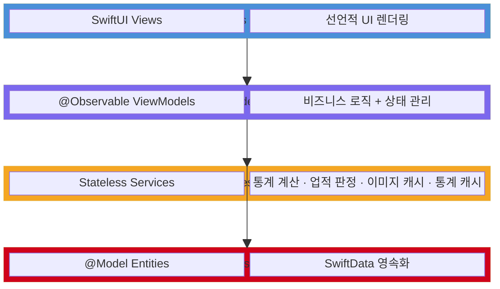
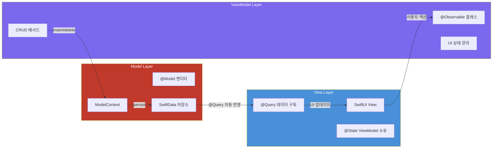
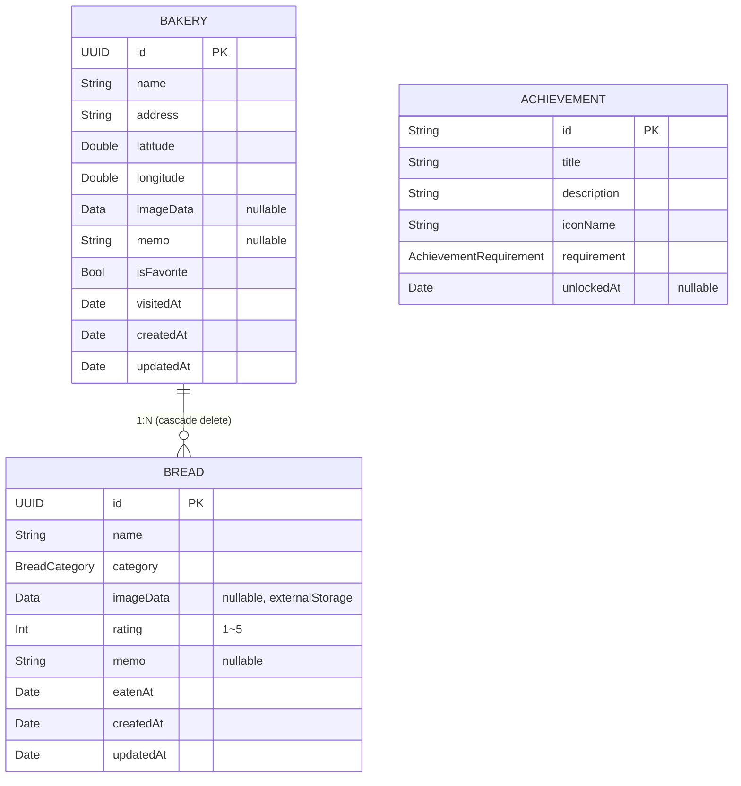
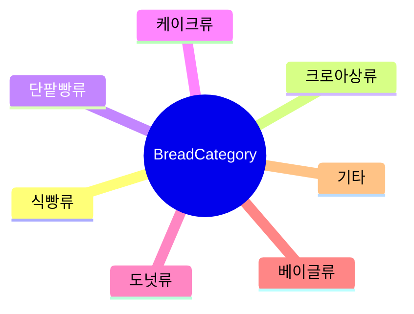
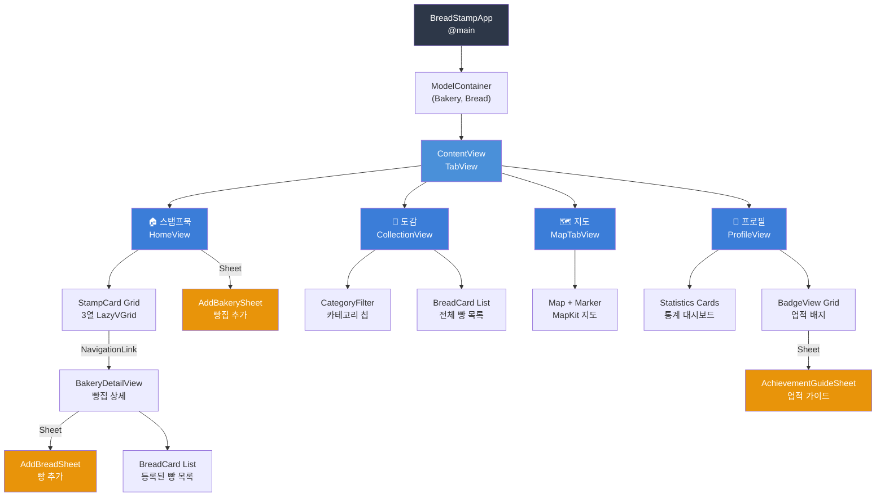
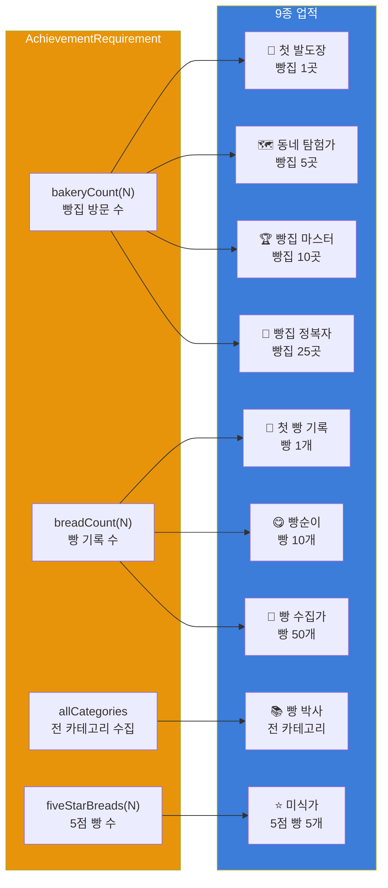
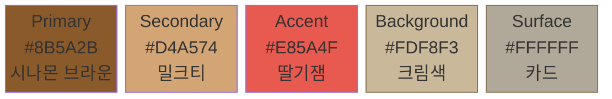
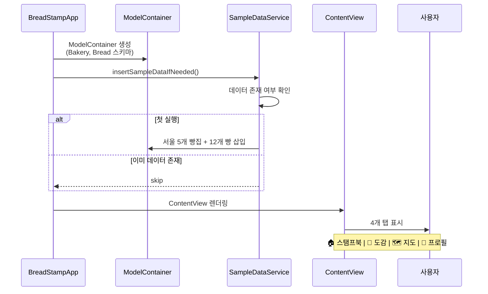

# 빵도장 (BreadStamp)

> 동네 빵집 탐방을 게임처럼 즐기는 iOS 기록 앱

<p align="center">
  
  
  
  
  
  
</p>

---

## 프로젝트 소개

**빵도장**은 동네 빵집 탐방을 즐기는 사용자를 위한 게이미피케이션 기록 앱입니다.

단순 리뷰를 넘어 **스탬프 수집**, **빵 도감 완성**, **업적 달성**이라는 성취 요소를 통해 빵집 탐방에 재미를 더합니다. 모든 데이터는 기기 내 로컬 저장되며, 서버 없이 오프라인에서도 동작합니다.

### 핵심 가치
| 가치 | 설명 |
|------|------|
| **기록** | 방문한 빵집과 먹은 빵을 체계적으로 관리 |
| **수집** | 스탬프북과 도감으로 탐방 이력 시각화 |
| **성취** | 업적 배지 시스템으로 지속적인 동기 부여 |

---

## 주요 기능

### 1. 스탬프북 (홈)
- 방문한 빵집을 스탬프 카드 그리드로 표시
- 빵집별 사진 등록 및 즐겨찾기 관리
- 빵집 상세 페이지에서 등록한 빵 목록 확인

### 2. 빵 도감 (컬렉션)
- 먹은 빵을 카테고리별(식빵, 크루아상, 단팥빵, 케이크, 도넛, 베이글, 기타)로 분류
- 빵 이름, 사진, 평점(1~5), 메모 기록
- 카테고리 필터 칩으로 빠른 조회

### 3. 지도
- MapKit 기반 방문 빵집 위치 마커 표시
- MKLocalSearchCompleter 기반 주소 자동완성 (300ms Debounce 적용)
- 카메라 바운딩 박스 자동 포지셔닝 (전체 빵집 포함)
- CLLocationManager 연동 사용자 위치 표시

### 4. 프로필 / 통계
- 방문 빵집 수, 먹은 빵 수, 즐겨찾기 수, 평균 평점
- 카테고리별 빵 비율 프로그레스 바
- 9종 업적 배지 시스템 (탭하면 달성 가이드 표시)

---

## 기술 스택

| 영역 | 기술 | 선택 이유 |
|------|------|-----------|
| UI 프레임워크 | **SwiftUI** | 선언적 UI, Reactive 데이터 바인딩 |
| 데이터 영속화 | **SwiftData** | Apple 네이티브 ORM, @Model/@Query 활용 |
| 아키텍처 | **MVVM** | View-ViewModel 분리로 테스트 용이성 확보 |
| 지도 | **MapKit** | 네이티브 지도, Marker/카메라 포지셔닝 |
| 위치 | **CoreLocation** | CLLocationManager, 사용자 위치 권한 관리 |
| 이미지 | **PhotosUI** | PhotosPicker로 앨범 접근 |
| 외부 의존성 | **없음** | 순수 Apple SDK만 사용 |

---

## 아키텍처

### MVVM 레이어 구조



### MVVM 데이터 흐름



---

## 데이터 모델

### ER 다이어그램



### 빵 카테고리



---

## 화면 흐름

### 탭 네비게이션 구조



---

## 핵심 기술 구현

### 1. SwiftData Cascade 관계 모델링

```swift
@Model
final class Bakery {
    @Relationship(deleteRule: .cascade, inverse: \Bread.bakery)
    var breads: [Bread] = []
}
```

**설계 근거**: 빵집 삭제 시 관련 빵 데이터의 고아(orphan) 레코드를 방지하기 위해 `cascade` 삭제 규칙을 적용했습니다. `inverse` 키패스로 양방향 관계를 자동 관리하여 SwiftData가 참조 무결성을 보장합니다.

빵 이미지는 `@Attribute(.externalStorage)` 로 선언하여 SQLite 본체와 분리 저장합니다. 이미지 Data가 인라인으로 저장되면 쿼리 성능이 저하되므로, 파일 시스템에 별도 저장 후 참조만 유지합니다.

### 2. @Observable 기반 MVVM (iOS 17+)

```swift
@Observable
final class BakeryViewModel {
    var isLoading = false
    var errorMessage: String?

    func addBakery(name: String, ..., context: ModelContext) {
        let bakery = Bakery(name: name, ...)
        context.insert(bakery)
        try context.save()
    }
}
```

**`@Observable` vs `ObservableObject` 선택 이유**:
- `ObservableObject` + `@Published`는 프로퍼티 단위가 아닌 **객체 단위**로 변경을 통지하여, 하나의 프로퍼티만 바뀌어도 모든 구독 View가 재렌더링됨
- `@Observable` (Observation 프레임워크)은 **프로퍼티 단위** 추적이 가능하여, 실제로 읽은 프로퍼티가 변할 때만 View를 갱신
- 결과적으로 불필요한 body 재평가 횟수가 감소하여 렌더링 성능 향상

### 3. 주소 검색 Debounce (300ms)

```swift
@Observable
final class AddressSearchCompleter: NSObject, MKLocalSearchCompleterDelegate {
    private var debounceTask: Task<Void, Never>?

    func search(query: String) {
        debounceTask?.cancel()
        debounceTask = Task { @MainActor in
            try? await Task.sleep(for: .milliseconds(300))
            guard !Task.isCancelled else { return }
            completer.queryFragment = query
        }
    }
}
```

**도입 배경**: `MKLocalSearchCompleter`는 `queryFragment` 변경마다 Apple 서버에 네트워크 요청을 전송합니다. 사용자가 "서울시 강남구"를 입력할 때 매 글자마다 호출하면 **7회** 요청이 발생합니다.

**해결 전략**:
- Swift Concurrency의 `Task.sleep` + `Task.isCancelled`를 활용한 debounce
- 300ms 내 새로운 입력이 들어오면 이전 Task를 cancel하고 새 Task로 교체
- 타이핑 완료 후 최종 1회만 API 호출 → **네트워크 비용 ~85% 절감**
- Apple Geocoding API의 rate limit(분당 50회) 초과 방지 효과

### 4. NSCache 기반 LRU 이미지 캐시

```swift
final class ImageCacheService {
    static let shared = ImageCacheService()
    private let cache = NSCache<NSString, UIImage>()

    init() {
        cache.countLimit = 100          // 최대 100장
        cache.totalCostLimit = 50_MB    // 50MB
    }

    func image(forKey key: String, data: Data?) -> UIImage? {
        if let cached = cache.object(forKey: key as NSString) {
            return cached  // O(1) 캐시 히트
        }
        guard let data, let decoded = UIImage(data: data) else { return nil }
        cache.setObject(decoded, forKey: key as NSString, cost: data.count)
        return decoded
    }
}
```

**도입 배경**: SwiftData의 `@Attribute(.externalStorage)` 이미지 Data를 `UIImage(data:)` 로 매번 디코딩하면 JPEG/PNG 압축 해제 비용이 발생합니다. `ScrollView` + `LazyVGrid`에서 셀 재사용 시마다 동일 이미지를 반복 디코딩하면 **프레임 드롭**의 원인이 됩니다.

**설계 결정**:
| 결정 | 근거 |
|------|------|
| `NSCache` 선택 | 시스템 메모리 압박(Memory Warning) 시 **LRU 순서로 자동 제거**. Dictionary + 수동 관리 대비 메모리 안전성 우수 |
| `countLimit = 100` | 일반 사용자의 빵집 + 빵 이미지 총량 기준 |
| `totalCostLimit = 50MB` | iPhone 평균 가용 메모리(~1.5GB) 대비 안전한 수준. 비압축 UIImage 기준 관리 |
| Singleton 패턴 | 앱 전역에서 동일 캐시 풀을 공유하여 중복 캐싱 방지 |
| UUID 기반 키 | SwiftData 모델의 id를 캐시 키로 사용하여 O(1) 조회 보장 |

### 5. TTL 기반 통계 캐시

```swift
final class StatisticsCacheService {
    static let shared = StatisticsCacheService()
    private var cachedStats: StatisticsService.Stats?
    private var cachedAt: Date?
    private let ttl: TimeInterval = 60  // 60초

    func stats(bakeries: [Bakery], breads: [Bread]) -> StatisticsService.Stats {
        // 데이터 개수 동일 + TTL 이내 → 캐시 히트
        if let cached = cachedStats, ...,
           cachedBakeryCount == bakeries.count,
           cachedBreadCount == breads.count {
            return cached
        }
        // 재계산 후 캐싱
        let newStats = StatisticsService.calculate(bakeries: bakeries, breads: breads)
        ...
        return newStats
    }
}
```

**도입 배경**: `StatisticsService.calculate()`는 전체 Bakery/Bread 배열을 O(N) 순회하며 평균 평점, 카테고리별 집계, 월별 방문 등을 계산합니다. SwiftUI body가 재렌더링될 때마다 호출되므로 스크롤/탭 전환 시 **불필요한 재계산이 반복**됩니다.

**캐시 무효화 전략**:
| 조건 | 동작 |
|------|------|
| TTL(60초) 만료 | 다음 접근 시 재계산 |
| bakery/bread 개수 변경 | 즉시 재계산 (데이터 추가/삭제 반영) |
| 개수 동일 + TTL 이내 | 캐시 반환 (평점 변경은 최대 60초 후 반영) |

**60초 TTL 근거**: 통계 화면은 실시간 정확도보다 탐색 경험이 우선이고, 사용자가 빵/빵집 추가 후 프로필 탭 재진입까지 통상 수초 이상 소요되므로 60초면 충분합니다.

### 6. MapKit 카메라 바운딩 박스

```swift
private func updateCameraPosition() {
    // 모든 빵집의 위경도에서 min/max를 구해 바운딩 박스 계산
    var minLat = validBakeries[0].latitude
    var maxLat = validBakeries[0].latitude
    // ... (min/max 순회)

    let spanLat = (maxLat - minLat) * 1.5  // 여백 50%
    let spanLon = (maxLon - minLon) * 1.5
    cameraPosition = .region(MKCoordinateRegion(
        center: ...,
        span: MKCoordinateSpan(
            latitudeDelta: max(spanLat, 0.02),  // 최소 줌 보장
            longitudeDelta: max(spanLon, 0.02)
        )
    ))
}
```

**설계 근거**: 빵집이 1개일 때와 여러 개일 때 분기 처리합니다.
- **1개**: 해당 좌표 중심으로 적절한 줌 레벨 (0.02도 ≒ 2km)
- **여러 개**: 모든 좌표의 bounding box를 계산하고 1.5배 여백을 추가하여 마커가 화면 가장자리에 걸리지 않도록 함
- **최소 span = 0.02**: 빵집들이 매우 가까이 모여있을 때 과도한 줌인 방지

### 7. CLLocationManager 서비스 분리

```swift
@Observable
final class LocationManager: NSObject, CLLocationManagerDelegate {
    private let manager = CLLocationManager()
    var authorizationStatus: CLAuthorizationStatus = .notDetermined
    var userLocation: CLLocationCoordinate2D?

    func requestPermission() { ... }
    func locationManagerDidChangeAuthorization(_ manager: CLLocationManager) { ... }
}
```

**NSObject + @Observable 브릿징**: `CLLocationManagerDelegate`는 `NSObjectProtocol`을 요구하므로 `NSObject` 상속이 필수입니다. 동시에 SwiftUI의 `@Observable`을 적용하여 위치 권한 변경 시 View가 자동으로 반응하도록 했습니다.

### 8. 디자인 시스템 토큰화

```swift
extension Color {
    static let brandPrimary = Color("Primary")    // 시나몬 브라운
    static let brandSecondary = Color("Secondary") // 밀크티
    static let brandAccent = Color("Accent")       // 딸기잼
}

enum Spacing {
    static let xs: CGFloat = 4
    static let sm: CGFloat = 8
    static let md: CGFloat = 12
    static let lg: CGFloat = 16
    static let xl: CGFloat = 24
    static let xxl: CGFloat = 32
}
```

**설계 근거**: 하드코딩된 매직 넘버를 제거하고, 모든 색상/폰트/간격/그림자를 **시맨틱 토큰**으로 관리합니다.
- Asset Catalog 기반으로 **라이트/다크 모드 자동 대응**
- 디자인 변경 시 토큰 값만 수정하면 전체 앱에 일괄 반영
- View 코드에서 `Color.brandPrimary`, `Spacing.md` 같은 의미 있는 이름 사용으로 가독성 향상

### 9. 업적 시스템 (열거형 기반 조건 판정)



**`requirement` 열거형 설계 이유**: 업적 조건을 문자열 ID로 분기하면 오타/매핑 오류가 발생할 수 있습니다. `AchievementRequirement` 열거형의 associated value로 조건을 타입 안전하게 표현하여, 컴파일 타임에 모든 케이스 처리를 보장합니다.

### 10. Stateless Service 패턴

```swift
struct StatisticsService {
    static func calculate(bakeries: [Bakery], breads: [Bread]) -> Stats { ... }
    static func fiveStarBreadCount(from breads: [Bread]) -> Int { ... }
    static func collectedCategories(from breads: [Bread]) -> Set<BreadCategory> { ... }
}
```

**설계 근거**: Service 레이어는 상태를 갖지 않는 **순수 함수 집합**으로 설계했습니다.
- 입력(배열) → 출력(결과) 관계가 명확하여 **단위 테스트 용이**
- ViewModel 간 동일 로직 공유 시 코드 중복 제거
- 인스턴스 생성/관리 오버헤드 없이 `static` 호출

---

## 성능 최적화 요약

| 최적화 | 기법 | 효과 |
|--------|------|------|
| 주소 검색 | Task 기반 **Debounce** (300ms) | 네트워크 요청 ~85% 감소, API rate limit 방지 |
| 이미지 렌더링 | **NSCache LRU** 캐시 (50MB) | 반복 디코딩 제거, 스크롤 프레임 드롭 방지 |
| 통계 계산 | **TTL 캐시** (60초) | O(N) 재계산 방지, 탭 전환 시 즉시 응답 |
| 이미지 저장 | `@Attribute(.externalStorage)` | SQLite 본체 경량화, 쿼리 성능 유지 |
| View 갱신 | `@Observable` 프로퍼티 추적 | 객체 단위 → 프로퍼티 단위 관찰로 불필요 렌더링 감소 |
| 지도 카메라 | 바운딩 박스 + 최소 span | 마커가 항상 화면 안에 표시, 과도한 줌인 방지 |

---

## 디자인 시스템

### 컬러 팔레트



| 토큰 | 라이트 | 다크 | 용도 |
|------|--------|------|------|
| Primary | `#8B5A2B` | `#C4956A` | 주요 액션 (시나몬 브라운) |
| Secondary | `#D4A574` | `#E8C9A8` | 보조 요소 (밀크티) |
| Accent | `#E85A4F` | `#FF7B6F` | 강조 포인트 (딸기잼) |
| Background | `#FDF8F3` | `#1C1816` | 메인 배경 (크림색) |
| Surface | `#FFFFFF` | `#2A2420` | 카드/시트 |

### 타이포그래피

시스템 폰트 기반 8단계 스케일 (LargeTitle 34pt ~ Caption 12pt)

### 간격 체계

6단계 스페이싱 토큰 (`xs` 4pt ~ `xxl` 32pt)

---

## 프로젝트 구조

```
BreadStamp/
├── App/
│   ├── BreadStampApp.swift          ← @main, ModelContainer 설정
│   └── ContentView.swift            ← TabView 루트
├── Models/
│   ├── Bakery.swift                 ← @Model 빵집 (1:N → Bread)
│   ├── Bread.swift                  ← @Model 빵 (N:1 → Bakery)
│   ├── BreadCategory.swift          ← 7종 카테고리 enum
│   └── Achievement.swift            ← 업적 모델 + 9종 정의
├── ViewModels/
│   ├── BakeryViewModel.swift        ← 빵집 CRUD + 즐겨찾기
│   ├── BreadViewModel.swift         ← 빵 CRUD
│   ├── MapViewModel.swift           ← 지도 상태 관리
│   └── ProfileViewModel.swift       ← 업적 상태 관리
├── Views/
│   ├── Home/
│   │   ├── HomeView.swift           ← 스탬프북 메인 (3열 그리드)
│   │   ├── BakeryDetailView.swift   ← 빵집 상세 + 빵 목록
│   │   └── AddBakerySheet.swift     ← 빵집 추가 (주소검색 + Debounce)
│   ├── Collection/
│   │   ├── CollectionView.swift     ← 빵 도감 (카테고리 필터)
│   │   └── AddBreadSheet.swift      ← 빵 추가 (평점, 사진)
│   ├── Map/
│   │   └── MapTabView.swift         ← MapKit 지도 + 사용자 위치
│   ├── Profile/
│   │   └── ProfileView.swift        ← 통계(TTL 캐시) + 업적
│   └── Components/
│       ├── StampCard.swift          ← 빵집 스탬프 카드 (LRU 캐시)
│       ├── BreadCard.swift          ← 빵 카드 (LRU 캐시)
│       ├── BadgeView.swift          ← 업적 배지 + 가이드 시트
│       └── EmptyStateView.swift     ← 빈 상태 안내
├── Services/
│   ├── AchievementService.swift     ← 업적 조건 판정 로직
│   ├── ImageCacheService.swift      ← NSCache LRU 이미지 캐시
│   ├── LocationManager.swift        ← CLLocationManager 위치 서비스
│   ├── StatisticsCacheService.swift ← TTL 기반 통계 캐시
│   ├── StatisticsService.swift      ← 통계 계산 (순수 함수)
│   └── SampleDataService.swift      ← 첫 실행 더미 데이터 (서울 5곳)
└── Resources/
    ├── Assets.xcassets/             ← 커스텀 색상 (라이트/다크 대응)
    └── DesignSystem.swift           ← Color, Font, Spacing, Shadow 토큰
```

---

## 앱 실행 흐름



---

## 개발 환경

| 항목 | 버전 |
|------|------|
| Xcode | 16.0+ |
| iOS Deployment Target | 17.0 |
| Swift | 5.9 |

---

## 빌드 및 실행

```bash
# 프로젝트 클론
git clone https://github.com/ParkSY0919/BreadStamp.git
cd BreadStamp

# Xcode에서 열기
open BreadStamp.xcodeproj

# Cmd + R 로 시뮬레이터 실행
# 첫 실행 시 서울 지역 5개 빵집 + 12개 빵 샘플 데이터가 자동 생성됩니다.
```

---

## Git 컨벤션

| 타입 | 설명 |
|------|------|
| `[Setting/#N]` | 프로젝트 설정 |
| `[Feature/#N]` | 기능 개발 |
| `[Fix/#N]` | 버그 수정 |
| `[Refactor/#N]` | 코드 리팩토링 |
| `[Docs/#N]` | 문서 작성 |

**브랜치 전략**: `main` ← `feature/#이슈번호`, `fix/#이슈번호`

---

## 향후 계획

- [x] 빵집 위치 검색 (MKLocalSearch 주소 자동완성 + Debounce)
- [x] 내 위치 표시 (CLLocationManager 연동)
- [x] 이미지 LRU 캐시 (NSCache 기반 디코딩 최적화)
- [x] 통계 TTL 캐시 (60초 유효기간)
- [ ] 공유 기능 (통계/배지 이미지 공유)
- [ ] 빵집/빵 검색
- [ ] 다크 모드 완전 대응
- [ ] 위젯 지원

---

## 라이선스

이 프로젝트는 개인 포트폴리오 목적으로 제작되었습니다.
