# 빵도장 (BreadStamp)

> 동네 빵집 탐방을 게임처럼 즐기는 iOS 기록 앱

<p align="center">
  
  
  
  
  
  
</p>

---

## 프로젝트 소개

**빵도장**은 동네 빵집 탐방을 즐기는 사용자를 위한 게이미피케이션 기록 앱입니다.

단순 리뷰를 넘어 **스탬프 수집**, **빵 도감 완성**, **업적 달성**이라는 성취 요소를 통해 빵집 탐방에 재미를 더합니다. 모든 데이터는 기기 내 로컬 저장되며, 서버 없이 오프라인에서도 동작합니다.

### 핵심 가치
| 가치 | 설명 |
|------|------|
| **기록** | 방문한 빵집과 먹은 빵을 체계적으로 관리 |
| **수집** | 스탬프북과 도감으로 탐방 이력 시각화 |
| **성취** | 업적 배지 시스템으로 지속적인 동기 부여 |

---

## 주요 기능

### 1. 스탬프북 (홈)
- 방문한 빵집을 스탬프 카드 그리드로 표시
- 빵집별 사진 등록 및 즐겨찾기 관리
- 빵집 상세 페이지에서 등록한 빵 목록 확인

### 2. 빵 도감 (컬렉션)
- 먹은 빵을 카테고리별(식빵, 크루아상, 단팥빵, 케이크, 도넛, 베이글, 기타)로 분류
- 빵 이름, 사진, 평점(1~5), 메모 기록
- 카테고리 필터 칩으로 빠른 조회

### 3. 지도
- MapKit 기반 방문 빵집 위치 마커 표시
- 카메라 자동 포지셔닝 (전체 빵집이 보이도록)
- 즐겨찾기 빵집 마커 색상 구분

### 4. 프로필 / 통계
- 방문 빵집 수, 먹은 빵 수, 즐겨찾기 수, 평균 평점
- 카테고리별 빵 비율 프로그레스 바
- 9종 업적 배지 시스템 (탭하면 달성 가이드 표시)

---

## 기술 스택

| 영역 | 기술 | 선택 이유 |
|------|------|-----------|
| UI 프레임워크 | **SwiftUI** | 선언적 UI, Reactive 데이터 바인딩 |
| 데이터 영속화 | **SwiftData** | Apple 네이티브 ORM, @Model/@Query 활용 |
| 아키텍처 | **MVVM** | View-ViewModel 분리로 테스트 용이성 확보 |
| 지도 | **MapKit** | 네이티브 지도, Marker/카메라 포지셔닝 |
| 이미지 | **PhotosUI** | PhotosPicker로 앨범 접근 |
| 외부 의존성 | **없음** | 순수 Apple SDK만 사용 |

---

## 아키텍처

### MVVM 레이어 구조

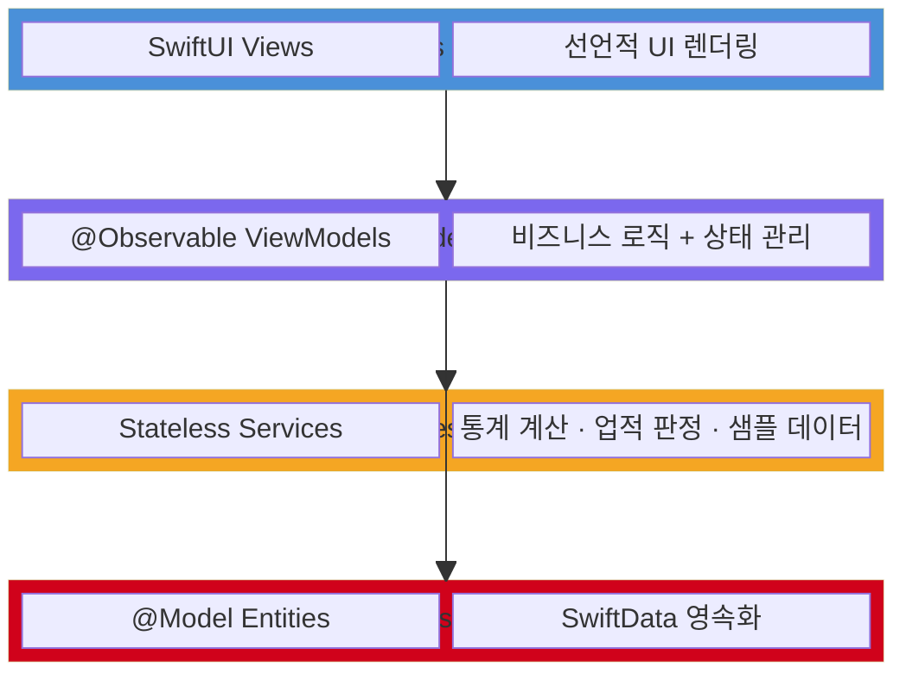

### MVVM 데이터 흐름

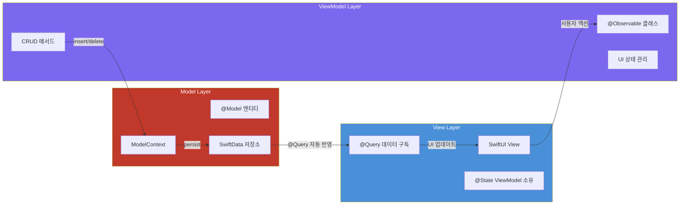

---

## 데이터 모델

### ER 다이어그램

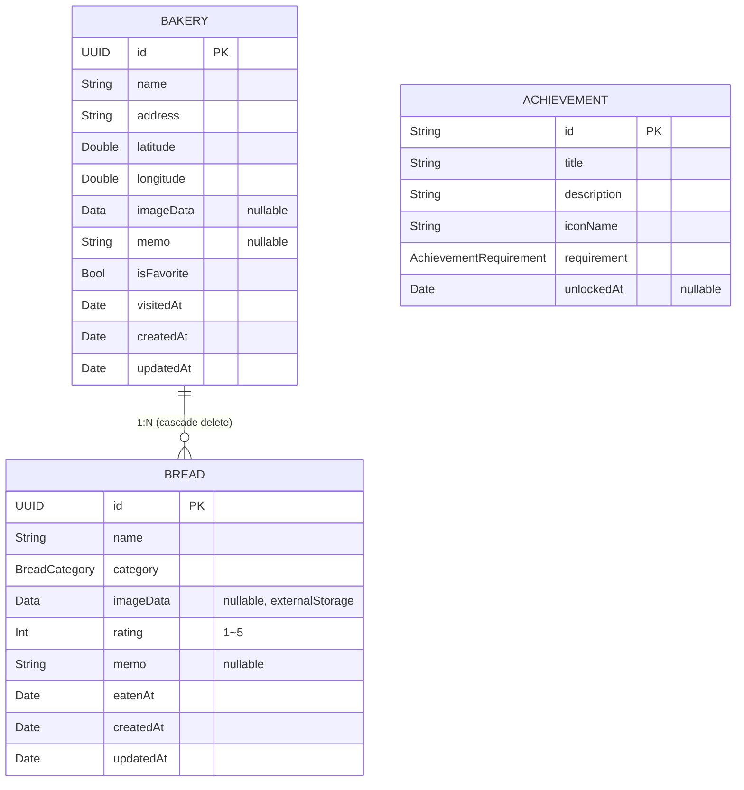

### 빵 카테고리

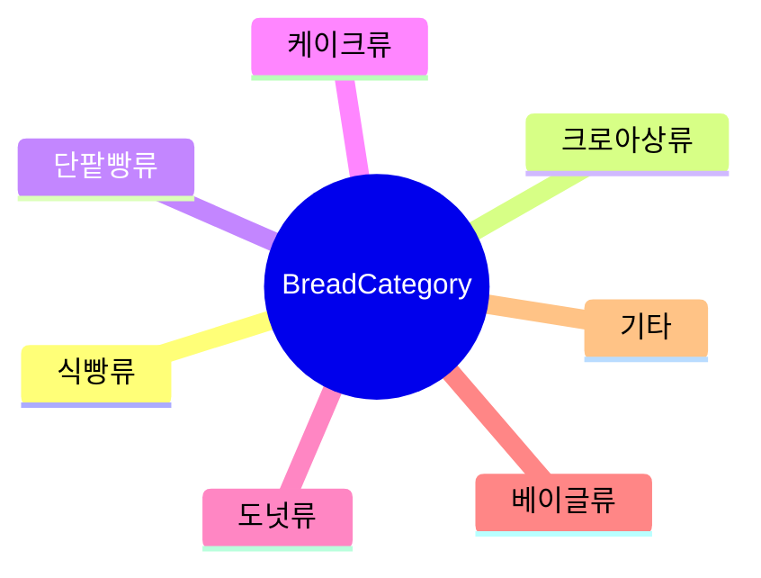

---

## 화면 흐름

### 탭 네비게이션 구조

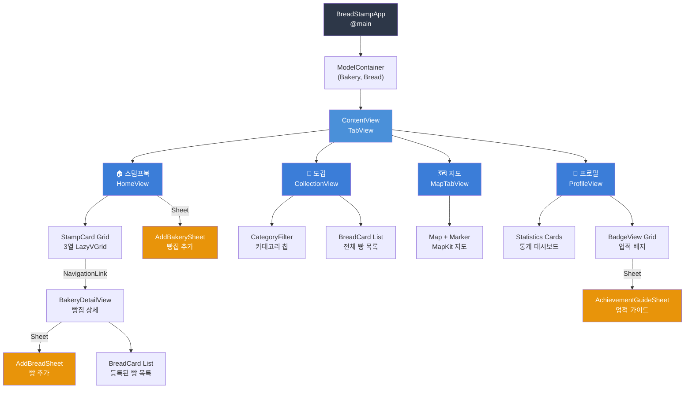

### 빵집 등록 시퀀스

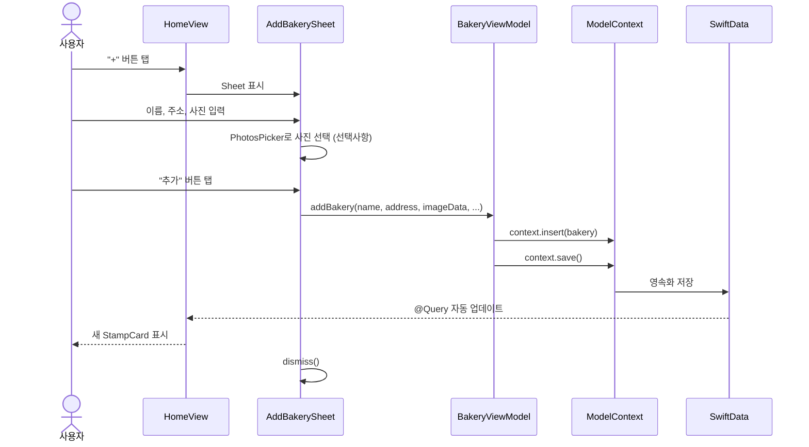

### 업적 달성 시퀀스

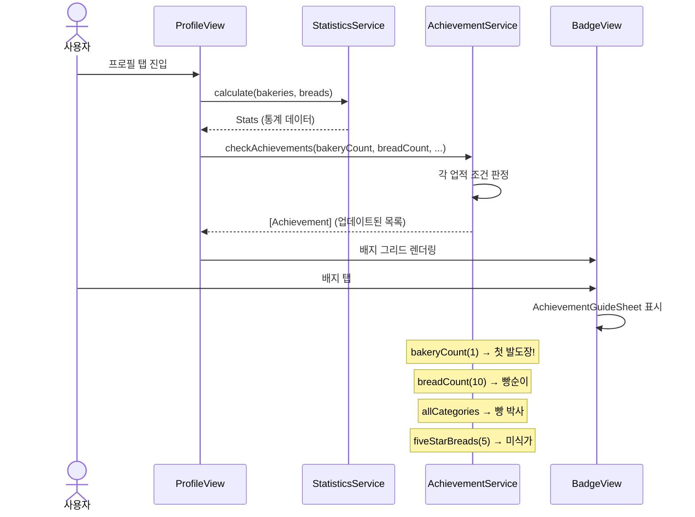

---

## View-ViewModel 의존성

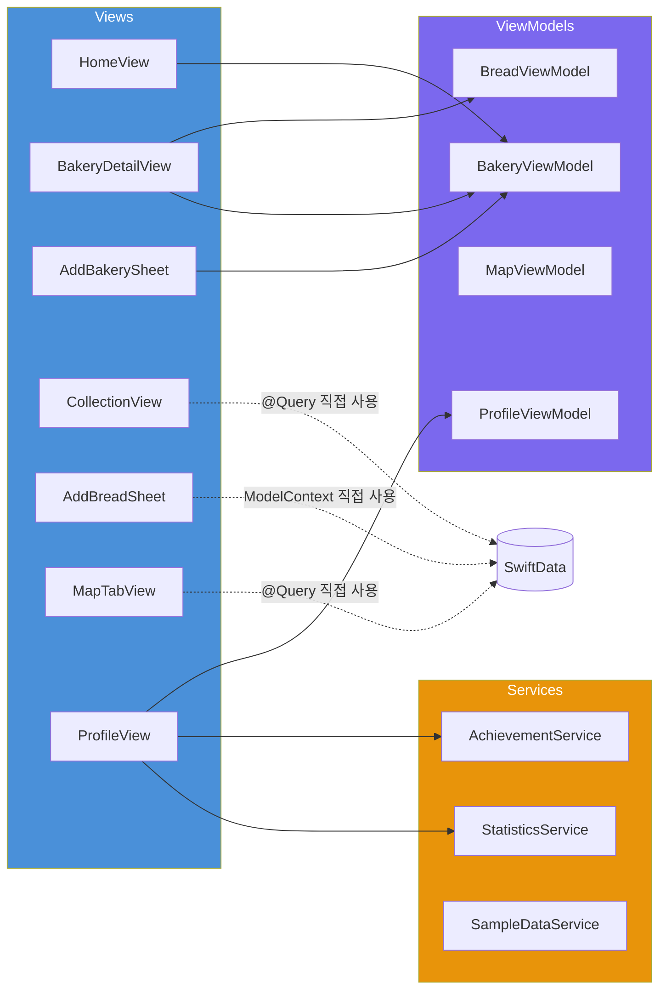

---

## 프로젝트 구조

```
BreadStamp/
├── App/
│   ├── BreadStampApp.swift          ← @main, ModelContainer 설정
│   └── ContentView.swift            ← TabView 루트
├── Models/
│   ├── Bakery.swift                 ← @Model 빵집 (1:N → Bread)
│   ├── Bread.swift                  ← @Model 빵 (N:1 → Bakery)
│   ├── BreadCategory.swift          ← 7종 카테고리 enum
│   └── Achievement.swift            ← 업적 모델 + 9종 정의
├── ViewModels/
│   ├── BakeryViewModel.swift        ← 빵집 CRUD + 즐겨찾기
│   ├── BreadViewModel.swift         ← 빵 CRUD
│   ├── MapViewModel.swift           ← 지도 상태 관리
│   └── ProfileViewModel.swift       ← 업적 상태 관리
├── Views/
│   ├── Home/
│   │   ├── HomeView.swift           ← 스탬프북 메인 (3열 그리드)
│   │   ├── BakeryDetailView.swift   ← 빵집 상세 + 빵 목록
│   │   └── AddBakerySheet.swift     ← 빵집 추가 (PhotosPicker)
│   ├── Collection/
│   │   ├── CollectionView.swift     ← 빵 도감 (카테고리 필터)
│   │   └── AddBreadSheet.swift      ← 빵 추가 (평점, 사진)
│   ├── Map/
│   │   └── MapTabView.swift         ← MapKit 지도 + 마커
│   ├── Profile/
│   │   └── ProfileView.swift        ← 통계 + 업적 대시보드
│   └── Components/
│       ├── StampCard.swift          ← 빵집 스탬프 카드
│       ├── BreadCard.swift          ← 빵 카드
│       ├── BadgeView.swift          ← 업적 배지 + 가이드 시트
│       └── EmptyStateView.swift     ← 빈 상태 안내
├── Services/
│   ├── AchievementService.swift     ← 업적 조건 판정 로직
│   ├── LocationManager.swift        ← CLLocationManager 위치 권한 관리
│   ├── StatisticsService.swift      ← 통계 계산 (카테고리, 평점 등)
│   └── SampleDataService.swift      ← 첫 실행 더미 데이터 (서울 5곳)
└── Resources/
    ├── Assets.xcassets/             ← 커스텀 색상 (라이트/다크 대응)
    └── DesignSystem.swift           ← Color, Font, Spacing, Shadow 토큰
```

---

## 구현 포인트

### 1. SwiftData 관계 모델링

```swift
@Model
final class Bakery {
    @Relationship(deleteRule: .cascade, inverse: \Bread.bakery)
    var breads: [Bread] = []
}
```
- `cascade` 삭제 규칙으로 빵집 삭제 시 관련 빵 자동 삭제
- `inverse` 키패스로 양방향 관계 자동 관리

### 2. @Observable 기반 MVVM

```swift
@Observable
final class BakeryViewModel {
    var isLoading = false
    var errorMessage: String?

    func addBakery(name: String, ..., context: ModelContext) {
        let bakery = Bakery(name: name, ...)
        context.insert(bakery)
        try context.save()
    }
}
```
- iOS 17의 `@Observable` 매크로 사용 (ObservableObject 대신)
- View에서 `@State private var viewModel = BakeryViewModel()`으로 소유

### 3. 디자인 시스템 토큰화

```swift
extension Color {
    static let brandPrimary = Color("Primary")    // 시나몬 브라운
    static let brandSecondary = Color("Secondary") // 밀크티
    static let brandAccent = Color("Accent")       // 딸기잼
}

enum Spacing {
    static let xs: CGFloat = 4
    static let sm: CGFloat = 8
    static let md: CGFloat = 12
    // ...
}
```
- 하드코딩 없이 모든 색상/폰트/간격/그림자를 토큰으로 관리
- Asset Catalog로 라이트/다크 모드 자동 대응

### 4. 업적 시스템

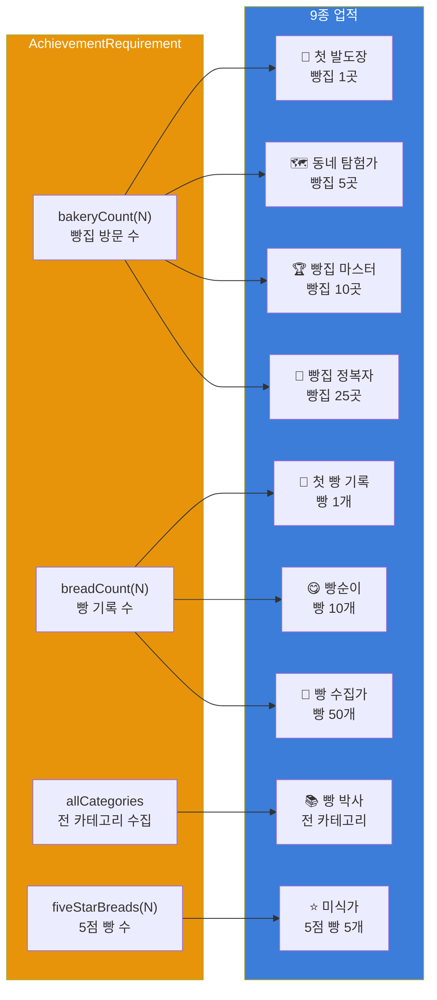

### 5. MapKit 카메라 자동 조정
- 등록된 빵집 좌표를 기반으로 모든 마커가 화면에 보이도록 `MKCoordinateRegion` 자동 계산
- 빵집 1개일 때와 여러 개일 때 분기 처리
- 즐겨찾기 빵집: 빨간 마커 / 일반 빵집: 파란 마커

### 6. PhotosPicker 이미지 등록
- 빵집/빵 등록 시 선택적 사진 첨부
- 사진 미리보기 및 삭제 기능
- 사진 미등록 시 SF Symbol 기본 아이콘 표시

---

## 디자인 시스템

### 컬러 팔레트

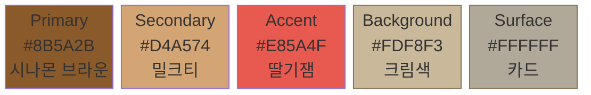

| 토큰 | 라이트 | 다크 | 용도 |
|------|--------|------|------|
| Primary | `#8B5A2B` | `#C4956A` | 주요 액션 (시나몬 브라운) |
| Secondary | `#D4A574` | `#E8C9A8` | 보조 요소 (밀크티) |
| Accent | `#E85A4F` | `#FF7B6F` | 강조 포인트 (딸기잼) |
| Background | `#FDF8F3` | `#1C1816` | 메인 배경 (크림색) |
| Surface | `#FFFFFF` | `#2A2420` | 카드/시트 |

### 타이포그래피

시스템 폰트 기반 8단계 스케일 (LargeTitle 34pt ~ Caption 12pt)

### 간격 체계

6단계 스페이싱 토큰 (`xs` 4pt ~ `xxl` 32pt)

---

## 앱 실행 흐름

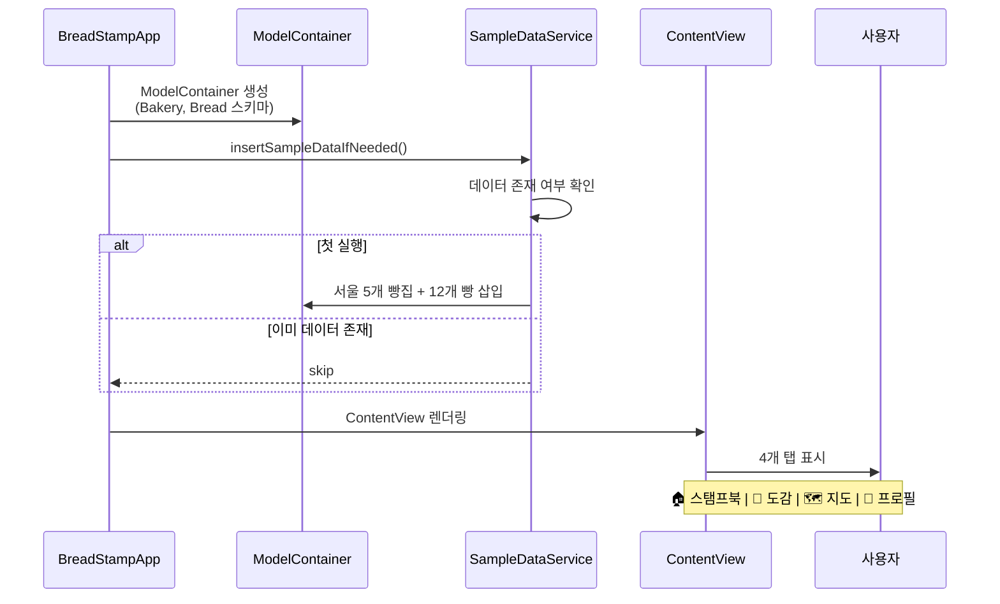

---

## 개발 환경

| 항목 | 버전 |
|------|------|
| Xcode | 16.0+ |
| iOS Deployment Target | 17.0 |
| Swift | 5.9 |
| 프로젝트 생성 | xcodegen |

---

## 빌드 및 실행

```bash
# 프로젝트 클론
git clone https://github.com/ParkSY0919/BreadStamp.git
cd BreadStamp

# Xcode에서 열기
open BreadStamp.xcodeproj

# Cmd + R 로 시뮬레이터 실행
# 첫 실행 시 서울 지역 5개 빵집 + 12개 빵 샘플 데이터가 자동 생성됩니다.
```

---

## Git 컨벤션

| 타입 | 설명 |
|------|------|
| `[Setting/#N]` | 프로젝트 설정 |
| `[Feature/#N]` | 기능 개발 |
| `[Fix/#N]` | 버그 수정 |
| `[Refactor/#N]` | 코드 리팩토링 |
| `[Docs/#N]` | 문서 작성 |

**브랜치 전략**: `main` ← `feature/#이슈번호`, `fix/#이슈번호`

---

## 향후 계획

- [x] 빵집 위치 검색 (MKLocalSearch 주소 자동완성)
- [x] 내 위치 표시 (CLLocationManager 연동)
- [ ] 공유 기능 (통계/배지 이미지 공유)
- [ ] 빵집/빵 검색
- [ ] 다크 모드 완전 대응
- [ ] 위젯 지원

---

## 라이선스

이 프로젝트는 개인 포트폴리오 목적으로 제작되었습니다.
